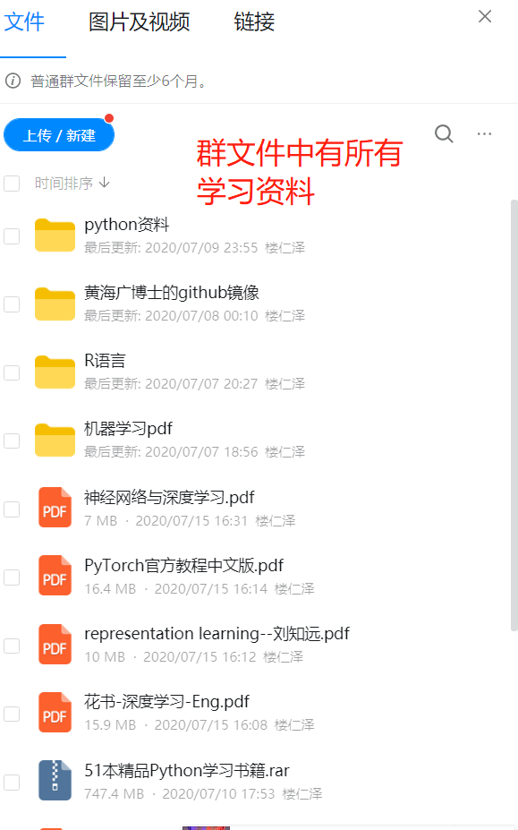

## CCAI Public Repositories

This Repositories is built for all AI learners in ZUCC to share information and learning materials.  

- **仓库归属于**：CCAI (City colleague AI Lab)
- **实验室坐标**：浙大城市学院理科四号楼538实验室
- **指导老师**：孙老师([学院主页](http://jsxy-zucc-edu-cn.vpn.zucc.edu.cn:8118/art/2020/4/8/art_2788_194362.html))
- **建立目的**：本仓库主要用于所有ZUCC的AI学习者进行AI相关学习资料分享，包含了历年实验室优秀学长们积累的学习资料，希望给萌新们的起步提供指引。同样，仓库也需要未来的CCAI优秀学子们一起维护和传承下去，我们也希望有更多的AI爱好者可以加入我们实验室！

## 学习资料整理：

1. Python基础
2. 深度学习框架
3. Deep Learning深度学习
4. Machine Learning机器学习

上面每个文件夹下都有对应学习资料的百度云链接，或者视频、书籍链接。其他的一些杂七杂八的资料暂时没有整理（因为太费时间），有兴趣的同学可以加入群聊自取：

